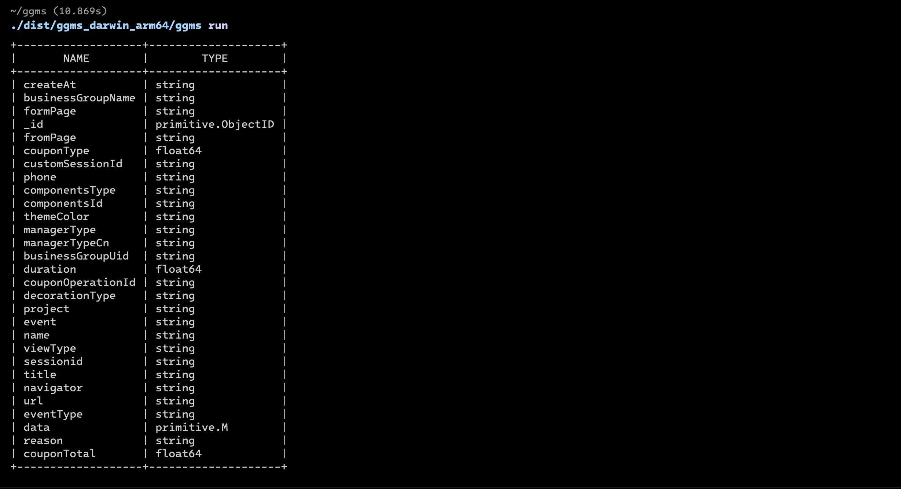

<br/>
<p align="center">
  <h3 align="center">GGMS</h3>

  <p align="center">
    Get the schema in a mongo collection
    <br/>
    <br/>
  </p>
</p>

  

## Table Of Contents

* [About the Project](#about-the-project)
* [Built With](#built-with)
* [Getting Started](#getting-started)
    * [Prerequisites](#prerequisites)
    * [Installation](#installation)
* [Usage](#usage)
* [Roadmap](#roadmap)
* [Contributing](#contributing)
* [Authors](#authors)
* [Acknowledgements](#acknowledgements)

## About The Project



Although mongo is a structureless database, there are times when we need to get a full definition of the structure. For example when defining fields for a data warehouse.

## Built With


* [urfave/cli](https://github.com/urfave/cli)
* [joho/godotenv](https://github.com/joho/godotenv)
* [mongo-driver/mongo](go.mongodb.org/mongo-driver/mongo)
* [olekukonko/tablewriter](https://github.com/olekukonko/tablewriter)

## Getting Started

This is an example of how you may give instructions on setting up your project locally.
To get a local copy up and running follow these simple example steps.

### Prerequisites

Nothing. Golang make pure.

### Installation

1. Download from release.

2. Put the binary to your PATH.

3. Test your PATH is right.

```sh
ggms -h
```

4. Init config and edit.

```sh
ggms init
```

5. Get schema.

```sh
ggms run
```

6. Maybe u need JSON output.

```sh
ggms run -o json
```

## Usage

Use this space to show useful examples of how a project can be used. Additional screenshots, code examples and demos work well in this space. You may also link to more resources.

_For more examples, please refer to the [Documentation](https://example.com)_

## Roadmap

See the [open issues](https://github.com/linbuxiao/ggms/issues) for a list of proposed features (and known issues).

## Contributing

Contributions are what make the open source community such an amazing place to be learn, inspire, and create. Any contributions you make are **greatly appreciated**.
* If you have suggestions for adding or removing projects, feel free to [open an issue](https://github.com/linbuxiao/ggms/issues/new) to discuss it, or directly create a pull request after you edit the *README.md* file with necessary changes.
* Please make sure you check your spelling and grammar.
* Create individual PR for each suggestion.
* Please also read through the [Code Of Conduct](https://github.com/linbuxiao/ggms/blob/main/CODE_OF_CONDUCT.md) before posting your first idea as well.

### Creating A Pull Request

1. Fork the Project
2. Create your Feature Branch (`git checkout -b feature/AmazingFeature`)
3. Commit your Changes (`git commit -m 'Add some AmazingFeature'`)
4. Push to the Branch (`git push origin feature/AmazingFeature`)
5. Open a Pull Request

## Authors

* **linbuxiao** - *Yee* - [linbuxiao](https://github.com/linbuxiao/) - *Init repo*
